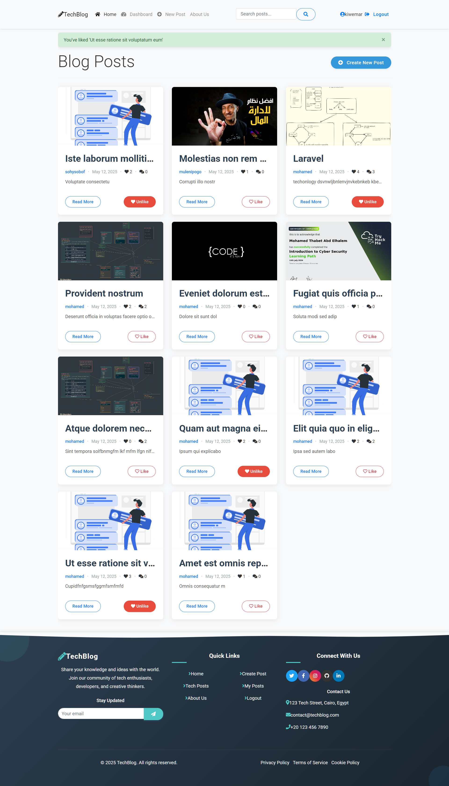
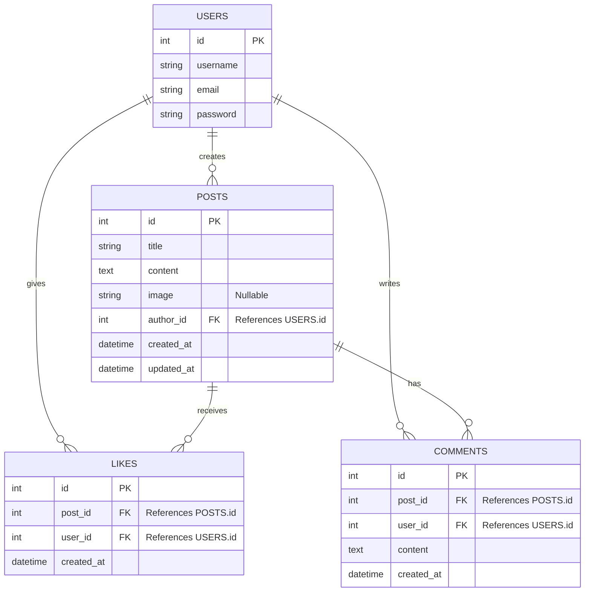

# TechBlog



TechBlog is a modern blogging platform built with Django that allows tech enthusiasts, developers, and creative thinkers to share their knowledge and ideas with the world. Users can create, read, like, and comment on posts.

## Features

- **User Authentication**: Register, login, and manage your profile
- **Blog Posts**: Create, edit, and delete your own posts with rich text formatting
- **Media Upload**: Add images to your blog posts
- **Engagement**: Like and comment on posts
- **User Dashboard**: Manage all your content in one place
- **Responsive Design**: Works on desktop, tablet, and mobile devices

## Database Design

The application uses a relational database model with the following structure:



## Installation

Follow these steps to set up and run the project locally:

### Prerequisites

- Python 3.8 or higher
- pip (Python package manager)
- virtualenv (recommended)

### Setup Steps

1. **Clone the repository** (if using Git) or download the project files:
   ```bash
   git clone https://github.com/yourusername/TechBlog.git
   cd TechBlog
   ```

2. **Create and activate a virtual environment**:
   ```powershell
   # Windows
   python -m venv venv
   .\venv\Scripts\activate
   ```

3. **Install dependencies**:
   ```bash
   pip install -r requirements.txt
   ```

   If requirements.txt is not available, install the necessary packages:
   ```bash
   pip install django pillow
   ```

4. **Apply migrations**:
   ```bash
   python manage.py migrate
   ```

5. **Create a superuser** (admin account):
   ```bash
   python manage.py createsuperuser
   ```

6. **Run the development server**:
   ```bash
   python manage.py runserver
   ```

7. **Access the application** at http://127.0.0.1:8000/

## Usage

1. Register a new account or login with existing credentials
2. Browse posts on the home page
3. Click on a post to view details and comments
4. Create your own posts from the dashboard
5. Like and comment on posts to engage with content

## Project Structure

```plain text
TechBlog/
├── blog/                   # Main application
│   ├── models.py           # Database models
│   ├── views.py            # View controllers
│   ├── urls.py             # URL routing
│   ├── forms.py            # Form definitions
│   └── templates/          # HTML templates
├── media/                  # Uploaded media files
├── static/                 # Static assets (CSS, JS, images)
├── TechBlog/              # Project configuration
│   ├── settings.py         # Project settings
│   └── urls.py             # Main URL routing
└── manage.py               # Django management script
```

## Technologies Used

- **Backend**: Django
- **Frontend**: HTML, CSS, JavaScript
- **Database**: SQLite (development) / PostgreSQL (production)
- **Styling**: Custom CSS
- **Media Storage**: Local file system

## License

© 2025 TechBlog. All rights reserved.

## Contact

- **Email**: mohamedthabetthabet36@gmail.con

