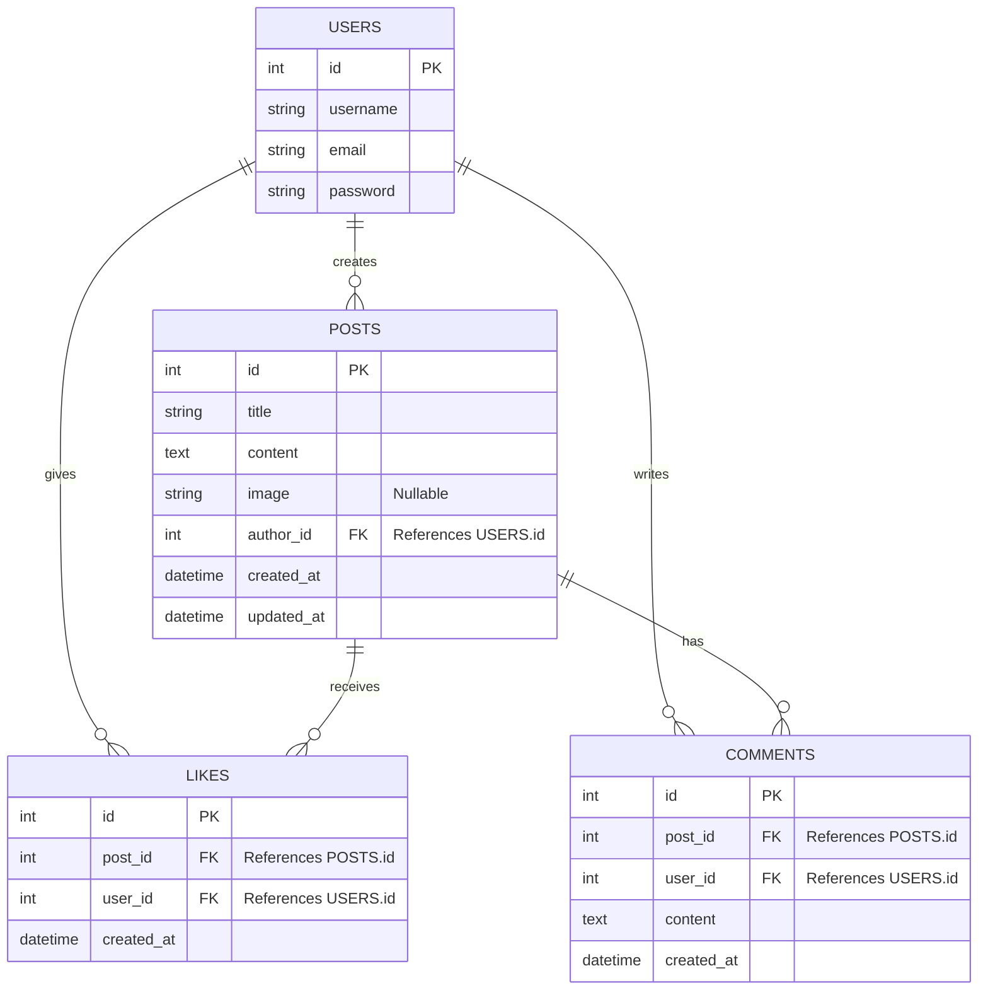

```mermaid
erDiagram
    USERS ||--o{ POSTS : creates
    USERS ||--o{ LIKES : gives
    USERS ||--o{ COMMENTS : writes
    POSTS ||--o{ LIKES : receives
    POSTS ||--o{ COMMENTS : has

    USERS {
        int id PK
        string username
        string email
        string password
    }

    POSTS {
        int id PK
        string title
        text content
        string image "Nullable"
        int author_id FK "References USERS.id"
        datetime created_at
        datetime updated_at
    }

    LIKES {
        int id PK
        int post_id FK "References POSTS.id"
        int user_id FK "References USERS.id"
        datetime created_at
    }

    COMMENTS {
        int id PK
        int post_id FK "References POSTS.id"
        int user_id FK "References USERS.id"
        text content
        datetime created_at
    }
```