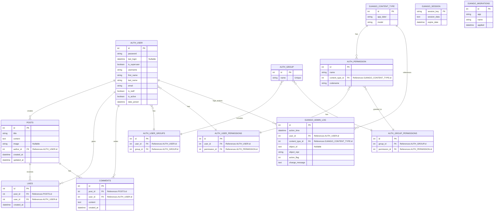
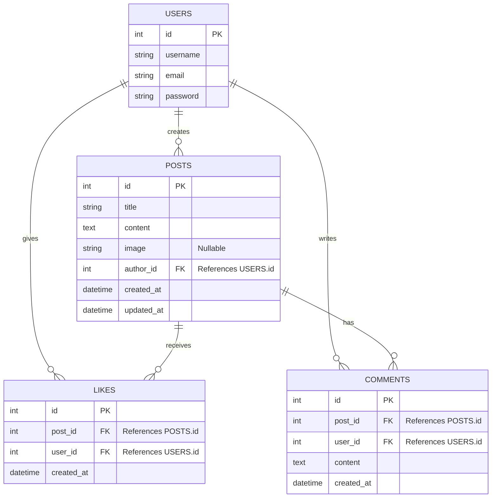

### database design of  project

```mermaid
erDiagram
    %% Core Blog Application Relationships
    AUTH_USER ||--o{ POSTS : creates
    AUTH_USER ||--o{ LIKES : gives
    AUTH_USER ||--o{ COMMENTS : writes
    POSTS ||--o{ LIKES : receives
    POSTS ||--o{ COMMENTS : has
    
    %% Django Auth System Relationships
    AUTH_USER }o--|| AUTH_USER_GROUPS : has
    AUTH_USER }o--|| AUTH_USER_PERMISSIONS : has
    AUTH_GROUP }o--|| AUTH_USER_GROUPS : includes
    AUTH_GROUP }o--|| AUTH_GROUP_PERMISSIONS : has
    AUTH_PERMISSION }o--|| AUTH_USER_PERMISSIONS : granted_to
    AUTH_PERMISSION }o--|| AUTH_GROUP_PERMISSIONS : granted_to
    DJANGO_CONTENT_TYPE ||--o{ AUTH_PERMISSION : has
    AUTH_USER ||--o{ DJANGO_ADMIN_LOG : logs_actions
    DJANGO_CONTENT_TYPE ||--o{ DJANGO_ADMIN_LOG : references
    
    %% Blog Application Tables
    AUTH_USER {
        int id PK
        string password
        datetime last_login "Nullable"
        boolean is_superuser
        string username
        string first_name
        string last_name
        string email
        boolean is_staff
        boolean is_active
        datetime date_joined
    }

    POSTS {
        int id PK
        string title
        text content
        string image "Nullable"
        int author_id FK "References AUTH_USER.id"
        datetime created_at
        datetime updated_at
    }

    LIKES {
        int id PK
        int post_id FK "References POSTS.id"
        int user_id FK "References AUTH_USER.id"
        datetime created_at
    }

    COMMENTS {
        int id PK
        int post_id FK "References POSTS.id"
        int user_id FK "References AUTH_USER.id"
        text content
        datetime created_at
    }
    
    %% Django Authentication System Tables
    AUTH_GROUP {
        int id PK
        string name "Unique"
    }

    AUTH_PERMISSION {
        int id PK
        string name
        int content_type_id FK "References DJANGO_CONTENT_TYPE.id"
        string codename
    }

    AUTH_GROUP_PERMISSIONS {
        int id PK
        int group_id FK "References AUTH_GROUP.id"
        int permission_id FK "References AUTH_PERMISSION.id"
    }

    AUTH_USER_GROUPS {
        int id PK
        int user_id FK "References AUTH_USER.id"
        int group_id FK "References AUTH_GROUP.id"
    }

    AUTH_USER_PERMISSIONS {
        int id PK
        int user_id FK "References AUTH_USER.id"
        int permission_id FK "References AUTH_PERMISSION.id"
    }

    %% Django Admin & Session Tables
    DJANGO_ADMIN_LOG {
        int id PK
        datetime action_time
        int user_id FK "References AUTH_USER.id"
        int content_type_id FK "References DJANGO_CONTENT_TYPE.id"
        text object_id "Nullable"
        string object_repr
        int action_flag
        text change_message
    }

    DJANGO_CONTENT_TYPE {
        int id PK
        string app_label
        string model
    }

    DJANGO_SESSION {
        string session_key PK
        text session_data
        datetime expire_date
    }

    DJANGO_MIGRATIONS {
        int id PK
        string app
        string name
        datetime applied
    }
```

### database design blog app

```mermaid
erDiagram
    USERS ||--o{ POSTS : creates
    USERS ||--o{ LIKES : gives
    USERS ||--o{ COMMENTS : writes
    POSTS ||--o{ LIKES : receives
    POSTS ||--o{ COMMENTS : has

    USERS {
        int id PK
        string username
        string email
        string password
    }

    POSTS {
        int id PK
        string title
        text content
        string image "Nullable"
        int author_id FK "References USERS.id"
        datetime created_at
        datetime updated_at
    }

    LIKES {
        int id PK
        int post_id FK "References POSTS.id"
        int user_id FK "References USERS.id"
        datetime created_at
    }

    COMMENTS {
        int id PK
        int post_id FK "References POSTS.id"
        int user_id FK "References USERS.id"
        text content
        datetime created_at
    }
```